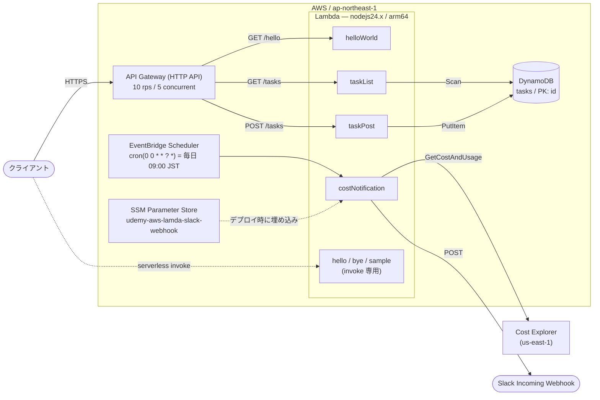

# sample — Serverless Framework AWS Lambda 練習用プロジェクト

Serverless Framework (v4) を使って Node.js の関数を AWS Lambda にデプロイする学習用サンプルです。`serverless invoke` から直接呼び出すだけの関数に加えて、HTTP API 経由のタスク CRUD (DynamoDB 永続化) と、日次で AWS 利用費を Slack に通知するスケジュール実行を含みます。

## 構成図



SSM からの Webhook URL 取得は実行時ではなくデプロイ時の解決 (`${ssm:...}`) で、値は環境変数として関数に埋め込まれます。詳細は [作業記録](docs/2026-09-01-cost-notification-lambda.md) を参照してください。

## 設定

| 項目 | 値 |
| --- | --- |
| org | `kazu1216727` |
| app / service | `sample` |
| プロバイダ | AWS |
| ランタイム | `nodejs24.x` |
| アーキテクチャ | `arm64` |
| リージョン | `ap-northeast-1` (東京) |
| プラグイン | `serverless-api-gateway-throttling` |

### ファイル

- [serverless.yml](serverless.yml) — サービス・プロバイダ・関数・DynamoDB テーブルの定義
- [handler.js](handler.js) — `hello` / `bye`
- [src/handler.js](src/handler.js) — `sample`
- [src/hello.js](src/hello.js) — `GET /hello`
- [src/taskHandler.js](src/taskHandler.js) — `GET /tasks` / `POST /tasks`
- [src/costNotification.js](src/costNotification.js) — 日次のコスト通知

### 関数

| 関数名 | ハンドラ | トリガー | 概要 |
| --- | --- | --- | --- |
| `hello` | [handler.hello](handler.js#L1) | invoke のみ | `{"message":"こんにちは！"}` |
| `bye` | [handler.bye](handler.js#L10) | invoke のみ | `{"message":"さよなら！"}` |
| `sample` | [src/handler.sample](src/handler.js#L1) | invoke のみ | `{"message":"サンプルです！"}` |
| `helloWorld` | [src/hello.handler](src/hello.js#L1) | `GET /hello` | `{"message":"Hello, World!"}` |
| `taskList` | [src/taskHandler.list](src/taskHandler.js#L31) | `GET /tasks` | `tasks` テーブルを Scan して返す |
| `taskPost` | [src/taskHandler.post](src/taskHandler.js#L8) | `POST /tasks` | `title` を受け取り UUID を採番して PutItem |
| `costNotification` | [src/costNotification.handler](src/costNotification.js#L10) | cron (毎日 09:00 JST) | 今月の利用費を Cost Explorer から取得し Slack へ通知 |

### IAM

`provider.iam` にまとめて定義しており、全関数が同じロールを共有します (`Resource: "*"`)。

| Action | 用途 |
| --- | --- |
| `ce:GetCostAndUsage` | `costNotification` |
| `dynamodb:PutItem` | `taskPost` |
| `dynamodb:Scan` | `taskList` |

## 使い方

### 準備

```
npm install
```

デプロイには AWS の認証情報と、`serverless.yml` の `org` に対応する Serverless Framework のアクセスキーが必要です。

### デプロイ

```
serverless deploy
```

実行すると次のような出力になります。

```
Deploying "sample" to stage "dev" (ap-northeast-1)

✔ Service deployed to stack sample-dev (90s)

functions:
  hello: sample-dev-hello (1.5 kB)
  bye: sample-dev-bye (1.5 kB)
```

### 呼び出し

デプロイ後、次のコマンドで関数を実行できます。

```
serverless invoke --function hello
serverless invoke --function bye
serverless invoke --function sample
```

`hello` の結果は次のようになります。

```json
{
  "statusCode": 200,
  "body": "{\"message\":\"こんにちは！\"}"
}
```

HTTP API のエンドポイントは `serverless deploy` の出力に表示されます。

```
curl "$ENDPOINT/hello"
curl "$ENDPOINT/tasks"
curl -X POST "$ENDPOINT/tasks" -H 'Content-Type: application/json' -d '{"title":"買い物"}'
```

### ローカル開発

```
serverless dev
```

AWS Lambda のローカルエミュレータが起動し、リクエストが AWS Lambda との間でトンネリングされます。クラウド上で動かしているのと同じ感覚で関数を呼び出せるため、再デプロイなしにコードを書き換えて結果をすぐ確認できます。

開発が終わったら `serverless deploy` でクラウドへ反映してください。

When you are done developing, don't forget to run `serverless deploy` to deploy the function to the cloud.

## 作業記録

- [2026-09-01 コスト通知 Lambda の追加と、その周辺で踏んだ落とし穴](docs/2026-09-01-cost-notification-lambda.md)
  — `${ssm:...}` が秘密を隠さない件、`package.json` 無しの `npm install` が
  `node_modules` を刈る件、デプロイ zip への CLI 混入。
- [2026-09-01 Slack 送信の実装で ESM と CommonJS を混ぜて壊した話](docs/2026-09-01-slack-webhook-esm-cjs.md)
  — `import` と `exports` の混在でハンドラが未エクスポートになる件、
  `node -e` がモジュール形式の検証に使えない件。
- [2026-09-01 aws-sdk v2 から v3 への移行と、`invoke local` の ERR_MODULE_NOT_FOUND](docs/2026-09-01-aws-sdk-v3-esbuild.md)
  — `AWS is not defined` の正体、Serverless v4 の esbuild が `.js` では既定で走らない件、
  古いバックアップで編集中のファイルを上書きした失敗。
- [2026-09-02 HTTP API に throttling を入れた理由と、それが CloudFormation に残らない件](docs/2026-09-02-api-gateway-throttling.md)
  — API Gateway の既定上限がアカウント上限と同値な件、プラグインが CFN ではなく
  デプロイ後の API 直叩きで設定する件、スロットル時に 429 ではなく 503 が返った件。
- [2026-09-02 変更セットが固まる前に PR を作って本文がズレた件と、`gh pr edit` が落ちる件](docs/2026-09-02-pr-body-drift.md)
  — PR 本文が diff を否定したままマージされた件、`gh pr edit` が projectCards の
  GraphQL エラーで落ちる件（マージとは無関係）、失敗の原因を直前の状態変化に誤って帰した件。
- [2026-09-02 `{"message":"Internal Server Error"}` を「繋がらない」と読み違えた話](docs/2026-09-02-lambda-500-debugging.md)
  — Lambda プロキシ統合の 500 に情報が無い件、存在しないテーブルで `AccessDenied` が
  返る件、ログ整形でタイムスタンプを捨てて誤認した件。
- [2026-09-02 前回の学びを次の PR で適用した回と、`gh pr list` で PR が「消えた」件](docs/2026-09-02-pr-workflow-applied.md)
  — PR を最後に作って本文と差分を突き合わせた件、マージまで2分未満が実測2件で
  裏付けられた件、`gh pr list` の既定を状態変化と読み違えた件、他人が編集中の
  作業ツリーを避けるための `git worktree`。
